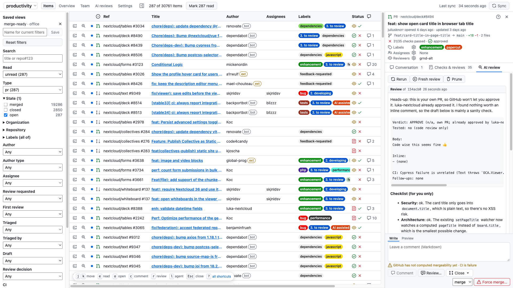

# gh-org-dashboard

A local dashboard for every issue and pull request across your GitHub orgs and repos. It's built for
working through a large inbox fast: filter, read, triage, review and merge without leaving one page,
and hand pull requests to a coding agent when you want a second pair of eyes.



## Features

- **One list for everything.** Issues, pull requests and security advisories from all your orgs, synced
  every 5 minutes into a local SQLite database and rendered as a fast virtual table.
- **Filters that stick.** Filter by read state, type, state, org, repo, labels, author, assignee,
  review request, CI, review decision, triage and dates. Filters live in the URL, and saved views
  keep them with the selected team preset.
- **Read tracking.** Unread items are marked and come back when they change. Mark them read one by one
  with `e` or all at once.
- **Details sidebar.** Description, comments, checks and reviews for the selected item. Comment, edit
  labels, assignees and reviewers, close issues as completed, not planned or duplicate, approve, request
  changes and merge, all from the keyboard (`?` lists the shortcuts).
- **Overview and Team.** Weekly activity, time to first review, time to triage, stale and waiting items
  per repository for the selected preset, plus per-person workload for the team.
- **Coding agent sessions.** Start an interactive Claude Code (or custom) session for a PR, issue or
  advisory in iTerm or cmux, in the right checkout and a separate worktree.
- **Background AI reviews.** Fire off a review of a PR, keep working, and read the result in the
  sidebar when it's done. Rerun it after new pushes or ask follow-up questions.
- **Desktop app.** The same server and UI as a macOS app.

## Getting started

```sh
npm install
npm run build && npm start        # http://localhost:3001
# or for development:
npm run server & npm run dev      # http://localhost:5173
```

The Settings page opens on first start to set up your presets. It needs `gh` to be logged in, or a
`GITHUB_TOKEN`.

## Configuration

Teams are defined as presets on the Settings page. They are stored in the untracked `presets.json`;
see `presets.example.json` for the format. Each entry is either an org or a single `owner/repo`:

```json
{
  "web": ["my-org"],
  "mobile": ["my-org/ios-app", "other-org/android-app"]
}
```

All presets are synced into one database, and the header switches between them.
Authors count as members when they belong to the org that owns the repo.

The Settings page also holds the coding agent options: the terminal (iTerm or cmux), the agent
(Claude Code or a custom command such as `codex {prompt}`), the folder with your checkouts, an optional
superproject whose submodules are used instead of separate checkouts, the review prompt, and the
background review command for custom agents.

Optional `.env` in the project root:

```sh
GITHUB_TOKEN=                   # default: `gh auth token`
PORT=3001
CMUX_SOCKET_PASSWORD=           # only with cmux socketControlMode "password"
```

## Details sidebar

Click a row (or use `j`/`k`, `Esc` to close) to open its details. Merge is only offered when CI passes
and the PR is approved; otherwise a force merge asks you to type `repo#number`. In the review dialog,
`⌘Enter` submits.

## Coding agent sessions

The terminal button on every row starts an interactive session with an editable prompt and extra
instructions. Claude Code sessions run in a separate git worktree by default.

The checkout is searched up to four levels below the repository folder, including nested repositories and
submodules (for example `~/repos/nextcloud/server/apps-extra/deck`), by matching any git remote. When several
checkouts match, the dialog asks which one to use and stores it as the default in `mapping.json`
(`{ "owner/repo": "~/path" }`, next to `presets.json`). Without a match the repository is cloned into the folder.

cmux only accepts commands from processes started inside cmux by default. Either start the server from a
cmux terminal, or set `automation.socketControlMode` to `password` in `~/.config/cmux/cmux.json` and put
the password in `CMUX_SOCKET_PASSWORD`.

## AI reviews

The AI review button next to the terminal button starts a review in the background. It spins while the
review runs and turns green when it's ready or red when it failed; clicking it then opens the result in
the "AI review" tab of the details sidebar.

- **Run** checks out the PR head in a detached worktree under `data/reviews/` and runs the review prompt.
- **Rerun** reviews what changed since the last run. The tab warns when the PR moved on.
- **Fresh review** starts over, and **Ask** refines the review with a follow-up question.
- **Prune** deletes the review together with its worktree.

The "AI reviews" page lists all reviews and suggests open PRs that request your review, each with a
button to start one.

Claude Code resumes its session between turns and only gets read-only tools (`--permission-mode dontAsk`),
since it reads untrusted PR content without supervision. A custom agent uses the background review command
from Settings, gets earlier turns in its prompt, and must be made read-only by that command.

## Desktop app

A macOS app built with [Tauri](https://tauri.app) wraps the same server and UI. It needs Rust (`brew install rust`).

```sh
npm run app          # builds src-tauri/target/release/bundle/macos/GH Dashboard.app and a .dmg
npm run app:dev      # runs it unbundled
npm run app:install  # builds and installs it to /Applications
```

The build downloads the official Node binary matching your `node -v` and bundles it with the server.
The app keeps its database, `presets.json`, `.env` and `server.log` in `~/Library/Application Support/local.gh-org-dashboard/`.
It uses `gh`, `git` and `claude` from your login shell's PATH.
`app:install` seeds a new app data folder from `data/dashboard.db` and `presets.json` when they exist.

## Development

```sh
npm run typecheck
node --test server/ shared/ web/
```

## License

[AGPL-3.0-or-later](LICENSE)
